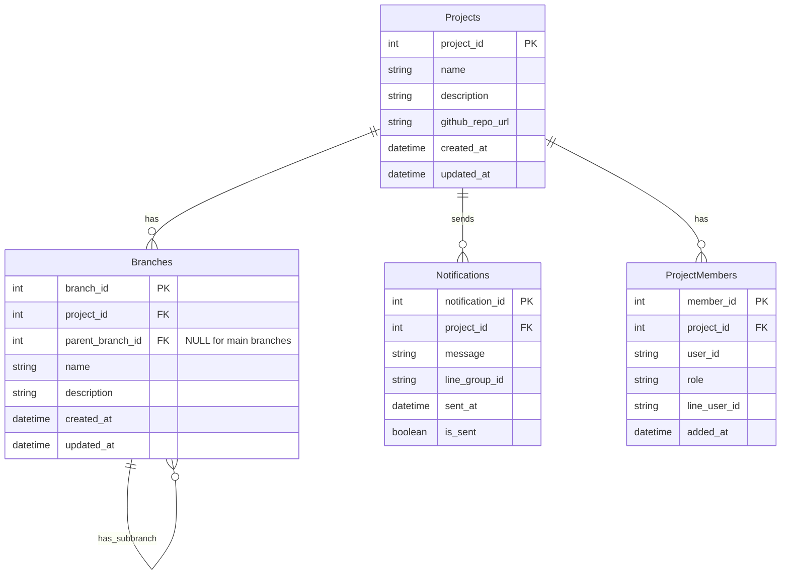

# LINE WORK MANAGE

## ERD 

```mermaid
erDiagram
    Projects ||--o{ Branches : has
    Projects {
        int project_id PK
        string name
        string description
        string github_repo_url
        datetime created_at
        datetime updated_at
    }
    
    Branches ||--o{ Branches : has_subbranch
    Branches {
        int branch_id PK
        int project_id FK
        int parent_branch_id FK "NULL for main branches"
        string name
        string description
        datetime created_at
        datetime updated_at
    }
    
    Projects ||--o{ Notifications : sends
    Notifications {
        int notification_id PK
        int project_id FK
        string message
        string line_group_id
        datetime sent_at
        boolean is_sent
    }
    
    Projects ||--o{ ProjectMembers : has
    ProjectMembers {
        int member_id PK
        int project_id FK
        string user_id
        string role
        string line_user_id
        datetime added_at
    }
```